# Module 4: Vision-Language-Action (VLA)

**Focus**: The convergence of Large Language Models and Robotics

## What is VLA?

**Vision-Language-Action (VLA)** models represent the next frontier in robotics:

- **Vision**: Understand what the robot sees
- **Language**: Comprehend natural language commands
- **Action**: Execute physical tasks in the real world

This module brings together everything you've learned to create truly intelligent robots.

## Voice-to-Action Pipeline

### Using OpenAI Whisper for Voice Commands

**Whisper** is an open-source speech recognition model:

```python
import whisper

# Load Whisper model
model = whisper.load_model("base")

# Transcribe voice command
result = model.transcribe("command.mp3")
command = result["text"]
# Output: "Clean the room"
```

### End-to-End Voice Control

```mermaid
graph LR
    A[🎤 Voice Input] --> B[Whisper STT]
    B --> C[LLM Planner]
    C --> D[ROS 2 Actions]
    D --> E[🤖 Robot Execution]
    E --> F[👁️ Vision Feedback]
    F --> C
```



## Cognitive Planning with LLMs

Large Language Models (GPT-4, Claude) can translate high-level goals into actionable robot commands.

### Example: Natural Language to ROS Actions

**Input**: "Clean the room"

**LLM Planning Output**:
```json
{
  "plan": [
    {"action": "navigate", "params": {"location": "living_room"}},
    {"action": "detect_objects", "params": {"category": "clutter"}},
    {"action": "pick", "params": {"object_id": "toy_1"}},
    {"action": "navigate", "params": {"location": "toy_box"}},
    {"action": "place", "params": {"container": "toy_box"}},
    {"action": "repeat", "params": {"until": "room_clean"}}
  ]
}
```

### Implementation

```python
import openai
from robot_controller import RobotController

def plan_with_llm(user_command: str) -> list:
    """Convert natural language to robot action sequence"""
    
    system_prompt = """
    You are a robot action planner. Convert user commands into 
    a sequence of robot actions: navigate, pick, place, detect_objects.
    """
    
    response = openai.ChatCompletion.create(
        model="gpt-4",
        messages=[
            {"role": "system", "content": system_prompt},
            {"role": "user", "content": user_command}
        ]
    )
    
    return parse_action_plan(response.choices[0].message.content)

# Execute plan
robot = RobotController()
plan = plan_with_llm("Clean the room")

for action in plan:
    robot.execute(action)
```

## Multi-Modal Interaction

Modern robots should understand multiple input modalities:

### Speech
- Natural language commands
- Questions ("Where is the kitchen?")
- Clarifications ("Pick up the red ball, not the blue one")

### Gesture
- Pointing at objects
- Hand signals for direction
- Body language for intent

### Vision
- Object recognition
- Scene understanding
- Person tracking

## Capstone Project: The Autonomous Humanoid

Your final project integrates all four modules:

### Project Requirements

**Scenario**: A humanoid robot in a simulated home environment receives the voice command:
> "Go to the kitchen and bring me a cup"

**Required Capabilities**:

1. ✅ **Speech Recognition** (Whisper): Transcribe the command
2. ✅ **LLM Planning** (GPT-4): Break down into subtasks
3. ✅ **Navigation** (Nav2): Navigate to the kitchen
4. ✅ **Object Detection** (Isaac ROS): Identify the cup
5. ✅ **Manipulation**: Pick up the cup with humanoid hand
6. ✅ **Return Navigation**: Navigate back to the user
7. ✅ **Handoff**: Place the cup in the user's hand

### Technical Stack

```
┌─────────────────────────────────────────┐
│          User Voice Command             │
└──────────────┬──────────────────────────┘
               │ Whisper
               ▼
┌─────────────────────────────────────────┐
│     GPT-4 Action Planning               │
└──────────────┬──────────────────────────┘
               │ ROS 2 Actions
               ▼
┌─────────────────────────────────────────┐
│  Robot Controller (ROS 2 + Nav2)        │
│  • Navigation                           │
│  • VSLAM                                │
│  • Object Detection (Isaac ROS)         │
│  • Manipulation                         │
└──────────────┬──────────────────────────┘
               │
               ▼
┌─────────────────────────────────────────┐
│  Simulated Humanoid (Isaac Sim/Gazebo)  │
└─────────────────────────────────────────┘
```

## Learning Objectives

### Week 13 Coverage

1. **Conversational AI Integration**: Connect GPT models to ROS 2
2. **Speech Recognition**: Implement Whisper for voice commands
3. **Natural Language Understanding**: Parse intent from user speech
4. **Multi-Modal Interaction**: Combine speech, gesture, and vision
5. **End-to-End System**: Build the complete autonomous pipeline

## Hands-On Projects

1. **Voice Command System**: Implement Whisper + GPT-4 integration
2. **Action Planning**: Translate "Make me coffee" into robot actions
3. **Multi-Modal UI**: Create a conversational robot interface
4. **Capstone Integration**: Complete the autonomous humanoid project

## The Future of Embodied AI

VLA models represent the convergence of:
- **Computer Vision** → Understanding the world
- **Natural Language Processing** → Understanding humans
- **Robotics** → Acting in the world

This is the foundation of truly general-purpose robots that can operate in human environments with minimal training.
