# Physical AI & Humanoid Robotics Course

A comprehensive guide to AI systems in the physical world and embodied intelligence.

# Introduction

# Welcome to Physical AI & Humanoid Robotics

**Focus and Theme**: AI Systems in the Physical World. Embodied Intelligence.

**Goal**: Bridging the gap between the digital brain and the physical body. Students apply their AI knowledge to control Humanoid Robots in simulated and real-world environments.

## Why Physical AI Matters

Humanoid robots are poised to excel in our human-centered world because they share our physical form and can be trained with abundant data from interacting in human environments. This represents a significant transition from AI models confined to digital environments to **embodied intelligence** that operates in physical space.

## Learning Outcomes

By the end of this course, you will:

- ✅ Understand Physical AI principles and embodied intelligence
- ✅ Master ROS 2 (Robot Operating System) for robotic control
- ✅ Simulate robots with Gazebo and Unity
- ✅ Develop with NVIDIA Isaac AI robot platform
- ✅ Design humanoid robots for natural interactions
- ✅ Integrate GPT models for conversational robotics

## Course Structure

This capstone quarter is divided into **4 core modules**:

1. **Module 1**: The Robotic Nervous System (ROS 2)
2. **Module 2**: The Digital Twin (Gazebo & Unity)
3. **Module 3**: The AI-Robot Brain (NVIDIA Isaac™)
4. **Module 4**: Vision-Language-Action (VLA)

Each module builds upon the previous, culminating in a **Capstone Project**: an autonomous humanoid robot that responds to voice commands, plans paths, navigates obstacles, and manipulates objects.


# Course Overview

# Quarter Overview

The future of AI extends beyond digital spaces into the physical world. This capstone quarter introduces **Physical AI**—AI systems that function in reality and comprehend physical laws.

Students learn to design, simulate, and deploy humanoid robots capable of natural human interactions using:

- **ROS 2** (Robot Operating System 2)
- **Gazebo** (Physics Simulation)
- **Unity** (High-Fidelity Rendering)
- **NVIDIA Isaac** (AI-Powered Robotics Platform)

## The Journey

This course takes you from understanding robotic middleware to deploying AI-powered humanoid robots:


## Capstone Project: The Autonomous Humanoid

Your final project will demonstrate the complete Physical AI pipeline:

1. **Voice Input**: Receive a natural language command (e.g., "Clean the room")
2. **Cognitive Planning**: Use an LLM to break down the command into ROS 2 actions
3. **Path Planning**: Navigate obstacles using Nav2
4. **Object Detection**: Identify targets using computer vision
5. **Manipulation**: Pick up and interact with objects
6. **Execution**: Complete the task autonomously in simulation

All of this runs in a **simulated environment** first, with optional deployment to real hardware.


# Hardware Requirements

# Hardware Requirements

This course is technically demanding. It sits at the intersection of three heavy computational loads:

- ⚙️ **Physics Simulation** (Isaac Sim/Gazebo)
- 👁️ **Visual Perception** (SLAM/Computer Vision)
- 🧠 **Generative AI** (LLMs/VLA)

## Two Implementation Options

### Option 1: High CapEx - On-Premise Lab
Build a physical lab at home with powerful workstations and robot hardware.

### Option 2: High OpEx - Cloud-Native Lab
Rent cloud instances for simulation and use edge devices for physical deployment.


## 2. The "Physical AI" Edge Kit

Students learn Physical AI by setting up the nervous system before deploying to a robot.

### The Economy Jetson Student Kit (~$700)

| Component | Model | Price | Notes |
|-----------|-------|-------|-------|
| **Brain** | NVIDIA Jetson Orin Nano Super (8GB) | $249 | 40 TOPS, price dropped from $499 |
| **Eyes** | Intel RealSense D435i | $349 | Includes IMU for SLAM |
| **Ears** | ReSpeaker USB Mic Array v2.0 | $69 | Far-field microphone for voice |
| **Storage** | 128GB microSD (high-endurance) | $30 | OS and models |
| **Total** | | **~$700** | Per student kit |

### What This Kit Enables

- ✅ Deploy ROS 2 nodes on edge hardware
- ✅ Run VSLAM (Visual SLAM) in real-time
- ✅ Understand resource constraints vs. workstations
- ✅ Test voice-to-action pipelines
- ✅ Prepare for robot deployment


## 4. Cloud-Native Alternative (High OpEx)

If you lack RTX-enabled workstations, use **cloud instances**.

### AWS Setup

**Instance Type**: AWS `g5.2xlarge` (A10G GPU, 24GB VRAM)

**Software**: NVIDIA Isaac Sim on Omniverse Cloud

**Cost Calculation**:
- Instance: ~$1.50/hour (spot/on-demand mix)
- Usage: 10 hours/week × 12 weeks = 120 hours
- Storage: ~$25/quarter
- **Total**: ~$205 per quarter per student

### The Latency Trap

:::danger
Controlling a real robot from a cloud instance is dangerous due to latency.

**Solution**: Train in the cloud, download model weights, and flash to local Jetson.
:::


## Recommendations

### For Budget-Conscious Programs

1. **Shared Workstations**: 1 RTX 4080 workstation per 3-4 students (for simulation)
2. **Individual Edge Kits**: Each student gets a Jetson kit ($700)
3. **Shared Robot**: 1 Unitree Go2 for the entire class

### For Well-Funded Programs

1. **Individual Workstations**: RTX 4090 per student
2. **Individual Edge Kits**: Jetson Orin Nano per student
3. **Multiple Robots**: 2-3 Unitree G1 humanoids for the lab


# Weekly Breakdown

# Weekly Breakdown

## Weeks 1-2: Introduction to Physical AI

**Theme**: From Digital AI to Embodied Intelligence

### Learning Objectives
- Understand Physical AI principles and embodied intelligence
- Transition from AI models confined to digital environments to robots operating in physical space
- Overview of humanoid robotics landscape
- Introduction to sensor systems

### Topics Covered
- 🤖 **Foundations of Physical AI**: What makes AI "physical"?
- 🌍 **Embodied Intelligence**: Robots that understand physical laws
- 📡 **Sensor Systems**:
  - LiDAR (Light Detection and Ranging)
  - Cameras (RGB, Depth, Stereo)
  - IMUs (Inertial Measurement Units)
  - Force/Torque Sensors

### Hands-On Activities
- Explore sensor data from different modalities
- Compare digital AI (ChatGPT) vs. embodied AI (robot navigation)
- Review humanoid robot demonstrations (Boston Dynamics, Unitree, Tesla Bot)


## Weeks 6-7: Robot Simulation with Gazebo

**Theme**: The Digital Twin

### Learning Objectives
- Set up Gazebo simulation environment
- Define robots using URDF and SDF formats
- Simulate physics (gravity, collisions, friction)
- Add sensors to simulated robots
- Introduction to Unity for high-fidelity visualization

### Week 6: Gazebo Basics
- Installing and configuring Gazebo
- Loading URDF models
- World files and environment design
- Physics engine configuration

### Week 7: Advanced Simulation
- Sensor plugins (LiDAR, cameras, IMU)
- Contact sensors and force feedback
- Integrating Gazebo with ROS 2
- Unity integration for rendering

### Hands-On Projects
- **Project 1**: Load a humanoid URDF and make it stand
- **Project 2**: Add a depth camera and visualize point clouds
- **Project 3**: Create a cluttered environment for navigation testing


## Weeks 11-12: Humanoid Robot Development

**Theme**: Bipedal Intelligence

### Learning Objectives
- Understand humanoid robot kinematics and dynamics
- Implement bipedal locomotion and balance control
- Master manipulation and grasping with humanoid hands
- Design natural human-robot interactions

### Week 11: Bipedal Locomotion
- Kinematics: Forward and inverse kinematics
- Dynamics: Zero-Moment Point (ZMP) and balance
- Gait patterns (walking, running, turning)
- Fall detection and recovery

### Week 12: Manipulation and Interaction
- Humanoid hand control (position, force, impedance)
- Grasping strategies (power grip, precision grip)
- Human-robot interaction design (proxemics, gestures)
- Safety considerations

### Hands-On Projects
- **Project 1**: Implement a walking controller for a simulated humanoid
- **Project 2**: Program a humanoid hand to grasp various objects
- **Project 3**: Design a human-robot handshake interaction


## Weekly Time Commitment

| Activity | Hours/Week |
|----------|------------|
| Lectures | 3-4 hours |
| Hands-On Labs | 4-6 hours |
| Project Work | 5-8 hours |
| Reading/Research | 2-3 hours |
| **Total** | **14-21 hours** |

:::tip
This is an intensive capstone course. Budget 15-20 hours per week for optimal learning.
:::


# Module 1: The Robotic Nervous System (ROS 2)

# Module 1: The Robotic Nervous System (ROS 2)

**Focus**: Middleware for robot control

## What is ROS 2?

ROS 2 (Robot Operating System 2) is the nervous system of modern robots. It's a middleware framework that allows different parts of a robot to communicate seamlessly.

## Key Concepts

### Nodes, Topics, and Services

- **Nodes**: Independent programs that perform specific tasks (e.g., motor controller, sensor reader, path planner)
- **Topics**: Communication channels where nodes publish and subscribe to data
- **Services**: Request-response communication between nodes

### Architecture

```
┌─────────────┐      ┌─────────────┐      ┌─────────────┐
│  Sensor     │      │   Brain     │      │  Actuator   │
│  Node       │─────▶│   Node      │─────▶│  Node       │
│ (Publisher) │      │(Subscriber) │      │(Subscriber) │
└─────────────┘      └─────────────┘      └─────────────┘
      │                    │                     │
      └────────────────────┴─────────────────────┘
                 ROS 2 Middleware
```

## Learning Objectives

### Week 3-5 Coverage

1. **ROS 2 Architecture**: Understand the core concepts and design philosophy
2. **Nodes, Topics, Services, and Actions**: Build communication systems
3. **Building ROS 2 Packages with Python**: Use `rclpy` to create Python-based nodes
4. **Launch Files and Parameter Management**: Automate robot startup and configuration

## Bridging Python Agents to ROS

One of the most powerful aspects of ROS 2 is integrating AI agents (trained in Python) with robotic hardware:

```python
import rclpy
from rclpy.node import Node
from geometry_msgs.msg import Twist

class HumanoidController(Node):
    def __init__(self):
        super().__init__('humanoid_controller')
        self.publisher = self.create_publisher(Twist, '/cmd_vel', 10)
        
    def move_forward(self, speed):
        msg = Twist()
        msg.linear.x = speed
        self.publisher.publish(msg)
```

## Understanding URDF for Humanoids

**URDF (Unified Robot Description Format)** is an XML format for describing robot geometry, kinematics, and dynamics.

### Example: Humanoid Arm Link

```xml
<link name="upper_arm">
  <visual>
    <geometry>
      <cylinder length="0.3" radius="0.05"/>
    </geometry>
  </visual>
  <collision>
    <geometry>
      <cylinder length="0.3" radius="0.05"/>
    </geometry>
  </collision>
  <inertial>
    <mass value="1.0"/>
    <inertia ixx="0.01" ixy="0.0" ixz="0.0" 
             iyy="0.01" iyz="0.0" izz="0.001"/>
  </inertial>
</link>
```

## Hands-On Projects

1. **ROS 2 Package Development**: Create a sensor-to-actuator pipeline
2. **URDF Modeling**: Design a simple humanoid arm
3. **Integration Test**: Connect a Python AI agent to ROS 2 control nodes


# Module 2: The Digital Twin (Gazebo & Unity)

# Module 2: The Digital Twin (Gazebo & Unity)

**Focus**: Physics simulation and environment building

## Why Simulation?

Before deploying AI to expensive hardware, we test in **digital twins**—virtual replicas of robots and environments that obey real-world physics.

## Gazebo: Physics Simulation

**Gazebo** is the industry-standard physics simulator for robotics. It simulates:

- ⚙️ **Gravity and Rigid Body Dynamics**
- 🔨 **Collisions and Friction**
- 📡 **Sensor Data** (LiDAR, cameras, IMUs)

### Simulating Physics

```xml
<world name="default">
  <physics type="ode">
    <gravity>0 0 -9.81</gravity>
    <max_step_size>0.001</max_step_size>
    <real_time_factor>1.0</real_time_factor>
  </physics>
</world>
```

### Example: Humanoid in Gazebo

Your humanoid robot will be loaded from a URDF file into Gazebo, where it can:
- Walk on uneven terrain
- Respond to external forces (pushes, wind)
- Interact with objects (pick up, throw)

## Unity: High-Fidelity Rendering

While Gazebo handles physics, **Unity** provides:

- 🎨 **Photorealistic Graphics** for human-robot interaction studies
- 🧑‍🤝‍🧑 **Human Models** for social robotics scenarios
- 🌍 **Complex Environments** (homes, offices, factories)

### Unity ML-Agents Integration

Unity can be integrated with ROS 2 to train robots in visually rich environments:

```csharp
public class HumanoidAgent : Agent
{
    public override void OnActionReceived(ActionBuffers actions)
    {
        // Apply actions from ROS 2 or ML model
        float torque = actions.ContinuousActions[0];
        rb.AddTorque(Vector3.forward * torque);
    }
}
```

## Simulating Sensors

### LiDAR (Light Detection and Ranging)

Measures distance by emitting laser pulses:

```xml
<sensor name="lidar" type="ray">
  <ray>
    <scan>
      <horizontal>
        <samples>360</samples>
        <min_angle>-3.14</min_angle>
        <max_angle>3.14</max_angle>
      </horizontal>
    </scan>
    <range>
      <min>0.1</min>
      <max>30.0</max>
    </range>
  </ray>
</sensor>
```

### Depth Cameras

Provide RGB (color) + Depth (distance) information:
- Used for 3D object detection
- Essential for manipulation tasks
- Feeds data to computer vision models

### IMUs (Inertial Measurement Units)

Measure orientation and acceleration:
- Critical for balance control in bipedal robots
- Detects falls and instability
- Fuses with vision for robust localization

## Learning Objectives

### Week 6-7 Coverage

1. **Gazebo Environment Setup**: Install and configure simulation
2. **URDF and SDF Robot Descriptions**: Define robot geometry and physics
3. **Physics Simulation**: Configure gravity, collisions, and friction
4. **Sensor Simulation**: Add LiDAR, cameras, and IMUs to your robot
5. **Unity for Visualization**: Create high-fidelity environments

## Hands-On Projects

1. **Gazebo Simulation**: Load a humanoid URDF and make it stand
2. **Sensor Integration**: Add a depth camera and visualize point clouds
3. **Unity Environment**: Build a room with furniture for the robot to navigate


# Module 3: The AI-Robot Brain (NVIDIA Isaac)

# Module 3: The AI-Robot Brain (NVIDIA Isaac™)

**Focus**: Advanced perception and training with NVIDIA's AI robotics platform

## What is NVIDIA Isaac?

NVIDIA Isaac is a comprehensive platform for AI-powered robotics, consisting of three main components:

1. **Isaac Sim**: Photorealistic simulation for robot training
2. **Isaac ROS**: Hardware-accelerated perception and navigation
3. **Isaac SDK**: Tools for building intelligent robots

## Isaac Sim: Photorealistic Simulation

Isaac Sim is built on NVIDIA Omniverse and provides:

### Photorealistic Rendering
- **Ray Tracing**: Realistic lighting and shadows
- **Materials**: Physically accurate surface properties
- **Environments**: Pre-built warehouses, homes, and factories

### Synthetic Data Generation
Train computer vision models without manual labeling:
```python
import omni.isaac.core
from omni.isaac.synthetic_data import SyntheticDataHelper

# Generate labeled training data
sd_helper = SyntheticDataHelper()
rgb_data = sd_helper.get_rgb()
depth_data = sd_helper.get_depth()
semantic_labels = sd_helper.get_instance_segmentation()
```

### Domain Randomization
Vary lighting, textures, and object positions to improve sim-to-real transfer:
- Randomize camera angles
- Change lighting conditions
- Vary object appearances
- Add sensor noise

## Isaac ROS: Hardware-Accelerated Perception

Isaac ROS provides GPU-accelerated packages for real-time robotics:

### VSLAM (Visual SLAM)
**Visual Simultaneous Localization and Mapping**:
- Build a map of the environment
- Track robot position in real-time
- Use camera data (no GPS needed)

```bash
# Launch VSLAM node
ros2 launch isaac_ros_visual_slam isaac_ros_visual_slam.launch.py
```

### Object Detection
Real-time detection using NVIDIA DeepStream:
- Detect people, objects, obstacles
- 60+ FPS on Jetson hardware
- Integration with custom models

### Navigation Stack
Integration with Nav2 for autonomous navigation:
- Global path planning
- Local obstacle avoidance
- Recovery behaviors

## Nav2: Path Planning for Humanoids

**Nav2** is ROS 2's navigation framework, adapted for bipedal movement:

### Key Components

1. **Global Planner**: Finds the optimal path from A to B
2. **Local Planner**: Avoids dynamic obstacles in real-time
3. **Recovery Behaviors**: What to do when stuck
4. **Costmaps**: Represent navigable space

### Bipedal Challenges
Unlike wheeled robots, humanoids must:
- Maintain balance during turns
- Plan foot placements
- Adapt gait to terrain
- Recover from perturbations

```python
from nav2_simple_commander.robot_navigator import BasicNavigator

navigator = BasicNavigator()
goal_pose = PoseStamped()
goal_pose.header.frame_id = 'map'
goal_pose.pose.position.x = 2.0
goal_pose.pose.position.y = 1.0

navigator.goToPose(goal_pose)
```

## Learning Objectives

### Week 8-10 Coverage

1. **NVIDIA Isaac SDK and Isaac Sim**: Set up photorealistic simulation
2. **AI-Powered Perception**: Implement object detection and tracking
3. **Manipulation**: Control humanoid hands for grasping
4. **Reinforcement Learning**: Train robots with RL in simulation
5. **Sim-to-Real Transfer**: Deploy simulated models to real hardware

## Hands-On Projects

1. **Isaac Sim Setup**: Load a humanoid robot in a photorealistic environment
2. **VSLAM Pipeline**: Build a map using a robot-mounted camera
3. **Nav2 Integration**: Navigate a humanoid through obstacles
4. **Perception Pipeline**: Detect and track objects using Isaac ROS

## Why Isaac Matters

NVIDIA Isaac bridges the gap between:
- **Simulation** → **Reality** (Sim-to-real transfer)
- **AI Models** → **Robot Hardware** (Efficient deployment)
- **Prototype** → **Production** (Scalable robotics)

The platform leverages NVIDIA's GPU acceleration to run complex AI models in real-time on robots.


# Module 4: Vision-Language-Action (VLA)

# Module 4: Vision-Language-Action (VLA)

**Focus**: The convergence of Large Language Models and Robotics

## What is VLA?

**Vision-Language-Action (VLA)** models represent the next frontier in robotics:

- **Vision**: Understand what the robot sees
- **Language**: Comprehend natural language commands
- **Action**: Execute physical tasks in the real world

This module brings together everything you've learned to create truly intelligent robots.

## Voice-to-Action Pipeline

### Using OpenAI Whisper for Voice Commands

**Whisper** is an open-source speech recognition model:

```python
import whisper

# Load Whisper model
model = whisper.load_model("base")

# Transcribe voice command
result = model.transcribe("command.mp3")
command = result["text"]
# Output: "Clean the room"
```

### End-to-End Voice Control

```mermaid
graph LR
    A[🎤 Voice Input] --> B[Whisper STT]
    B --> C[LLM Planner]
    C --> D[ROS 2 Actions]
    D --> E[🤖 Robot Execution]
    E --> F[👁️ Vision Feedback]
    F --> C
```



## Cognitive Planning with LLMs

Large Language Models (GPT-4, Claude) can translate high-level goals into actionable robot commands.

### Example: Natural Language to ROS Actions

**Input**: "Clean the room"

**LLM Planning Output**:
```json
{
  "plan": [
    {"action": "navigate", "params": {"location": "living_room"}},
    {"action": "detect_objects", "params": {"category": "clutter"}},
    {"action": "pick", "params": {"object_id": "toy_1"}},
    {"action": "navigate", "params": {"location": "toy_box"}},
    {"action": "place", "params": {"container": "toy_box"}},
    {"action": "repeat", "params": {"until": "room_clean"}}
  ]
}
```

### Implementation

```python
import openai
from robot_controller import RobotController

def plan_with_llm(user_command: str) -> list:
    """Convert natural language to robot action sequence"""
    
    system_prompt = """
    You are a robot action planner. Convert user commands into 
    a sequence of robot actions: navigate, pick, place, detect_objects.
    """
    
    response = openai.ChatCompletion.create(
        model="gpt-4",
        messages=[
            {"role": "system", "content": system_prompt},
            {"role": "user", "content": user_command}
        ]
    )
    
    return parse_action_plan(response.choices[0].message.content)

# Execute plan
robot = RobotController()
plan = plan_with_llm("Clean the room")

for action in plan:
    robot.execute(action)
```

## Multi-Modal Interaction

Modern robots should understand multiple input modalities:

### Speech
- Natural language commands
- Questions ("Where is the kitchen?")
- Clarifications ("Pick up the red ball, not the blue one")

### Gesture
- Pointing at objects
- Hand signals for direction
- Body language for intent

### Vision
- Object recognition
- Scene understanding
- Person tracking

## Capstone Project: The Autonomous Humanoid

Your final project integrates all four modules:

### Project Requirements

**Scenario**: A humanoid robot in a simulated home environment receives the voice command:
> "Go to the kitchen and bring me a cup"

**Required Capabilities**:

1. ✅ **Speech Recognition** (Whisper): Transcribe the command
2. ✅ **LLM Planning** (GPT-4): Break down into subtasks
3. ✅ **Navigation** (Nav2): Navigate to the kitchen
4. ✅ **Object Detection** (Isaac ROS): Identify the cup
5. ✅ **Manipulation**: Pick up the cup with humanoid hand
6. ✅ **Return Navigation**: Navigate back to the user
7. ✅ **Handoff**: Place the cup in the user's hand

### Technical Stack

```
┌─────────────────────────────────────────┐
│          User Voice Command             │
└──────────────┬──────────────────────────┘
               │ Whisper
               ▼
┌─────────────────────────────────────────┐
│     GPT-4 Action Planning               │
└──────────────┬──────────────────────────┘
               │ ROS 2 Actions
               ▼
┌─────────────────────────────────────────┐
│  Robot Controller (ROS 2 + Nav2)        │
│  • Navigation                           │
│  • VSLAM                                │
│  • Object Detection (Isaac ROS)         │
│  • Manipulation                         │
└──────────────┬──────────────────────────┘
               │
               ▼
┌─────────────────────────────────────────┐
│  Simulated Humanoid (Isaac Sim/Gazebo)  │
└─────────────────────────────────────────┘
```

## Learning Objectives

### Week 13 Coverage

1. **Conversational AI Integration**: Connect GPT models to ROS 2
2. **Speech Recognition**: Implement Whisper for voice commands
3. **Natural Language Understanding**: Parse intent from user speech
4. **Multi-Modal Interaction**: Combine speech, gesture, and vision
5. **End-to-End System**: Build the complete autonomous pipeline

## Hands-On Projects

1. **Voice Command System**: Implement Whisper + GPT-4 integration
2. **Action Planning**: Translate "Make me coffee" into robot actions
3. **Multi-Modal UI**: Create a conversational robot interface
4. **Capstone Integration**: Complete the autonomous humanoid project

## The Future of Embodied AI

VLA models represent the convergence of:
- **Computer Vision** → Understanding the world
- **Natural Language Processing** → Understanding humans
- **Robotics** → Acting in the world

This is the foundation of truly general-purpose robots that can operate in human environments with minimal training.


# Assessments & Projects

# Assessments

This course uses **project-based assessments** to evaluate your mastery of Physical AI concepts. Each assessment builds on previous modules and culminates in a comprehensive capstone project.


## Assessment 2: Gazebo Simulation Implementation (20%)

**Due**: End of Week 7

### Objective
Create a realistic simulation environment for robot testing and development.

### Requirements

1. **Robot Model**:
   - Design a URDF/SDF robot model
   - Include at least 5 joints
   - Add visual and collision geometries

2. **Sensor Integration**:
   - Add at least 2 different sensor types (LiDAR, camera, IMU)
   - Visualize sensor data in RViz
   - Publish sensor data to ROS 2 topics

3. **World Design**:
   - Create a custom Gazebo world with obstacles
   - Include interactive objects
   - Configure physics parameters (gravity, friction)

4. **Integration**:
   - Launch robot in Gazebo via ROS 2 launch file
   - Demonstrate teleoperation or autonomous movement
   - Record simulation footage

### Evaluation Criteria

| Criterion | Points |
|-----------|--------|
| Robot Model Quality | 30% |
| Sensor Implementation | 30% |
| World Design | 20% |
| ROS 2 Integration | 20% |


## Capstone Project: Simulated Humanoid with Conversational AI (40%)

**Due**: End of Week 13 (Final Presentations)

### Objective
Design and deploy an autonomous humanoid robot capable of understanding voice commands, planning actions, navigating environments, and manipulating objects—all in a simulated environment.

### Project Scenario

**User Command**: "Go to the kitchen and bring me a cup"

**Robot Must**:
1. ✅ Recognize the voice command (Whisper)
2. ✅ Plan a sequence of actions (GPT-4/LLM)
3. ✅ Navigate to the kitchen (Nav2 + VSLAM)
4. ✅ Detect and locate the cup (Isaac ROS perception)
5. ✅ Pick up the cup (Manipulation controller)
6. ✅ Navigate back to the user
7. ✅ Hand off the cup

### Technical Requirements

#### 1. Speech-to-Action (15%)
- Implement OpenAI Whisper for speech recognition
- Parse voice commands into structured intents
- Handle clarification requests

#### 2. Cognitive Planning (20%)
- Use an LLM (GPT-4, Claude, or open-source) to plan actions
- Convert natural language to ROS 2 action sequences
- Handle failure recovery

#### 3. Navigation (20%)
- Implement Nav2 path planning
- Integrate VSLAM for localization
- Avoid static and dynamic obstacles

#### 4. Perception (20%)
- Object detection and classification
- 3D pose estimation
- Real-time processing (less than 500ms latency)

#### 5. Manipulation (15%)
- Humanoid hand control
- Grasp planning and execution
- Force-sensitive grasping

#### 6. System Integration (10%)
- All components work together seamlessly
- Proper error handling and logging
- Clean code architecture

### Deliverables

1. **Working Demo** (40%):
   - Live demonstration during final week
   - Video recording of successful execution
   - Handle at least 3 different voice commands

2. **Technical Documentation** (25%):
   - System architecture diagram
   - Component descriptions and interfaces
   - Setup and deployment instructions
   - Known limitations and future improvements

3. **Code Repository** (20%):
   - Clean, well-structured code
   - README with installation steps
   - Example usage and test cases
   - ROS 2 package structure

4. **Presentation** (15%):
   - 10-minute presentation to class
   - Slides explaining design decisions
   - Q&A session
   - Reflection on challenges and learnings

### Evaluation Rubric

| Component | Excellent (90-100%) | Good (80-89%) | Satisfactory (70-79%) | Needs Improvement (below 70%) |
|-----------|---------------------|---------------|----------------------|------------------------|
| **Voice Recognition** | 95% or higher accuracy, handles noise | 85-94% accuracy | 70-84% accuracy | below 70% accuracy |
| **Action Planning** | Optimal plans, handles edge cases | Good plans, some edge cases | Basic plans work | Plans often fail |
| **Navigation** | Smooth, optimal paths | Good paths, minor issues | Reaches goal with retries | Frequent failures |
| **Perception** | above 90% detection, robust | 80-90% detection | 70-80% detection | below 70% detection |
| **Manipulation** | Smooth grasps, no drops | Occasional retries needed | Multiple attempts | Frequent failures |
| **Integration** | Seamless, production-ready | Minor integration issues | Works with manual intervention | Components don't integrate |


## Academic Integrity

- All code must be your own or properly attributed
- You may use open-source libraries and frameworks
- Collaboration is encouraged, but submissions must be individual
- Generative AI (ChatGPT, Copilot) can be used for assistance, but you must understand and be able to explain all code


## Resources

- **Office Hours**: Weekly sessions for technical support
- **Discussion Forum**: Slack/Discord for peer collaboration
- **Documentation**: ROS 2, Isaac, Gazebo official docs
- **Hardware Lab**: Access to workstations and robots (schedule required)


